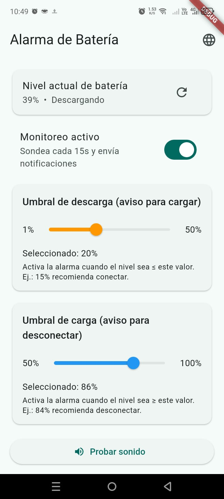

# 🔋 Battery Alarm & Monitor

Una utilidad de sistema diseñada para extender la vida útil de tu batería mediante la gestión inteligente de los ciclos de carga. Permite establecer alertas personalizadas para conectar y desconectar el cargador, manteniéndote en el rango óptimo (ej. 20% - 80%).

## 🌟 Características

* **Monitoreo Eficiente:** Servicio en segundo plano optimizado que sondea el estado de la batería cada 15 segundos con mínimo consumo de recursos.
* **Alertas Duales:**
    * **Umbral de Descarga:** Te avisa cuándo conectar el cargador (ej. al llegar al 20%).
    * **Umbral de Carga:** Te avisa cuándo desconectarlo para evitar micro-ciclos de carga al 100%.
* **Alcance Global (i18n):** Aplicación totalmente localizada en **10 idiomas**, incluyendo:
    * Español, Inglés, Chino (Simplificado), Japonés, Ruso, Hindi, Alemán, Francés, Italiano y Árabe.

## 📥 Descarga

Descarga el APK desde la sección de **[Releases](../../releases)** e instálalo en tu dispositivo Android.

---

> **Autor:** Raúl Héctor Cámara Carreón
